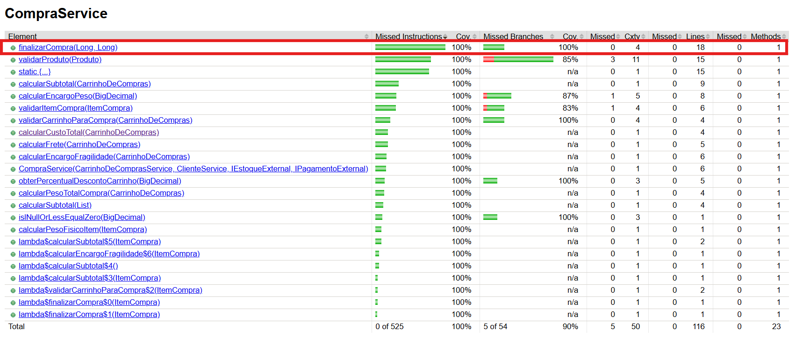

# Autores

Iago Macedo e Luis Scalabrin

# Instrução de Execução

```shell
git clone https://github.com/IagoGMacedo/DIM0507-Testes-Ecommerce.git
cd eCommerce
```

# Testes Obrigatórios para calcularCustoTotal()

#### Cobertura Estrutural

Execute o comando abaixo para gerar o relatório JaCoCo
```shell
mvn verify
```


#### Mutação

Executar com o wrapper do projeto (recomenda-se desabilitar o agente JaCoCo para evitar interferência na instrumentação do PIT):

```bash
./mvnw -Djacoco.skip=true -DskipTests=false org.pitest:pitest-maven:mutationCoverage
```

Como verificar se não restaram mutantes sobreviventes:

1. Abrir o relatório em target/pit-reports/ecommerce.service/index.html
2. Conferir se "Mutation Coverage" está em 100%
3. Abrir target/pit-reports/ecommerce.service/CompraService.java.html e confirmar que não existem entradas com o estado "SURVIVED". Todas devem ser "KILLED"

Principais estratégias utilizadas para matar mutantes:

- Cobertura completa de ramificações de `finalizarCompra`
- Testes de validação e fronteira: `null` e valores-limite para capturar mutadores de fronteira
- Cobertura de streams/lambdas com mocks e `ArgumentCaptor` para validar listas de IDs/quantidades
- Verificação de efeitos colaterais: asserts sobre chamadas externas para matar mutantes que removem chamadas void
- Testes combinados para cálculos para detectar mutações em operações aritméticas e arredondamento

# Testes Obrigatórios para finalizarCompra()

### Cobertura Estrutural

Execute o comando abaixo para gerar o relatório JaCoCo
```shell
mvn verify
```



### Cenários de teste

Os dois cenários foram implementados em CompraServiceFinalizarCompraCenario1Test.java e CompraServiceFinalizarCompraCenario2Test.java